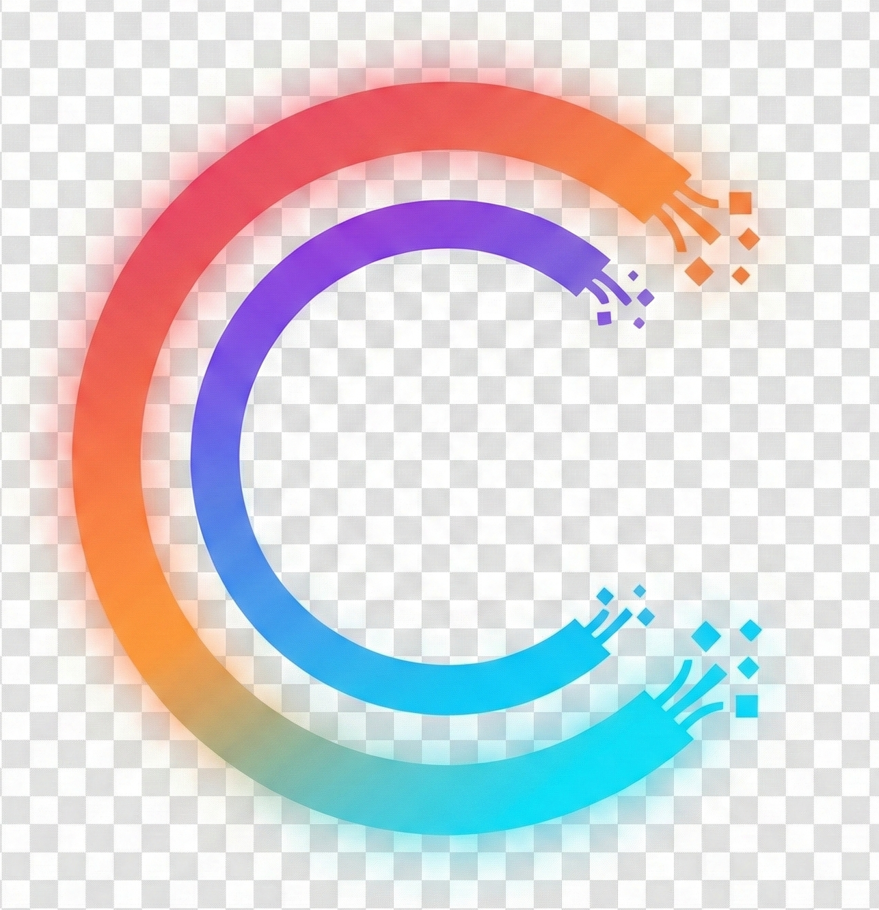

<p align="center">
  
</p>

<h1 align="center">Cordless</h1>

<p align="center">
  A self-hosted team chat application with audio/video calls
</p>

---

Cordless is a web-based chat application. It supports many of the features you'd
expect, including:

- Multiple rooms, with access controls
- Direct messages
- Audio/video calls with screen sharing
- File attachments with previews
- Search
- Notifications (via Web Push)
- @mentions
- API, with support for bot integrations

## Quick Start (Development)

For local development and testing:

```bash
# Clone the repository
git clone https://github.com/yourusername/cordless.git
cd cordless

# Copy environment file and generate secrets
cp .env.example .env
openssl rand -hex 64 >> .env  # Add as SECRET_KEY_BASE

# Start all services
docker compose up
```

The app will be available at http://localhost:3000

## Production Deployment

### Quick Deploy

Run this one-liner on your server to download all required files and generate a configured `.env`:

```bash
curl -fsSL https://raw.githubusercontent.com/kaitwalla/cordless/main/setup-production.sh | bash
```

This script will:
- Download `docker-compose.production.yml`, `Caddyfile`, `livekit.yaml`, and `Dockerfile`
- Generate secure secrets for Rails, Redis, and LiveKit
- Create a `.env` file configured for your domain
- Provide next steps for deployment

After running, simply:
```bash
docker compose -f docker-compose.production.yml build
docker compose -f docker-compose.production.yml up -d
```

---

### Manual Setup

If you prefer to set things up manually, follow the steps below.

The production setup uses:
- **Caddy** - Automatic HTTPS with Let's Encrypt
- **Redis** - Caching and background jobs
- **LiveKit** - Real-time audio/video calls
- **SQLite** - Database (persisted to volume)

### Step 1: Prerequisites

- A server with Docker and Docker Compose installed
- A domain name pointing to your server (e.g., `chat.example.com`)
- Ports 80, 443, 7881, and 7882/udp open in your firewall

### Step 2: Clone and Configure

```bash
# Clone the repository
git clone https://github.com/yourusername/cordless.git
cd cordless

# Create your environment file
cp .env.example .env
```

Edit `.env` with your production values:

```bash
# Required: Your domain name
DOMAIN=chat.example.com

# Required: Generate with: openssl rand -hex 64
SECRET_KEY_BASE=your_64_char_hex_secret_here

# Required: Generate with: openssl rand -hex 32
REDIS_PASSWORD=your_32_char_hex_password_here

# Required for video calls
# Generate key with: openssl rand -hex 16
# Generate secret with: openssl rand -hex 32
LIVEKIT_API_KEY=your_livekit_api_key
LIVEKIT_API_SECRET=your_livekit_api_secret
LIVEKIT_URL=wss://chat.example.com/livekit

# Optional: For push notifications
# Generate with: bundle exec rake vapid:generate (or use web-push gem)
VAPID_PUBLIC_KEY=
VAPID_PRIVATE_KEY=

# Optional: S3 storage (defaults to local storage)
# STORAGE_SERVICE=amazon
# AWS_ACCESS_KEY_ID=
# AWS_SECRET_ACCESS_KEY=
# AWS_REGION=us-east-1
# AWS_S3_BUCKET=

# Optional: Error tracking
# SENTRY_DSN=
```

### Step 3: Configure Caddy (SSL)

The included `Caddyfile` handles SSL automatically. Review it and update if needed:

```bash
# View the Caddyfile
cat Caddyfile
```

The default configuration:
- Automatically obtains SSL certificates from Let's Encrypt
- Proxies requests to the Rails application
- Handles WebSocket connections for real-time features
- Adds security headers

**Important:** Caddy needs ports 80 and 443 to be accessible from the internet
for Let's Encrypt certificate validation.

### Step 4: Configure LiveKit (Video Calls)

Review `livekit.yaml` for video call settings. The default configuration works
for most setups, but you may need to configure TURN servers for reliable calls
across restrictive networks:

```yaml
# In livekit.yaml, uncomment and configure:
turn:
  enabled: true
  domain: turn.example.com
  tls_port: 5349
  udp_port: 3478
```

See [LiveKit TURN documentation](https://docs.livekit.io/realtime/self-hosting/deployment/#turn-relay) for details.

### Step 5: Deploy

```bash
# Build the application image
docker compose -f docker-compose.production.yml build

# Start all services
docker compose -f docker-compose.production.yml up -d

# View logs
docker compose -f docker-compose.production.yml logs -f

# Check service status
docker compose -f docker-compose.production.yml ps
```

Your app should now be available at `https://chat.example.com`

### Step 6: First-Time Setup

1. Visit your domain in a browser
2. Create your admin account
3. Configure your organization settings
4. Invite team members

## Managing Your Deployment

### View Logs

```bash
# All services
docker compose -f docker-compose.production.yml logs -f

# Specific service
docker compose -f docker-compose.production.yml logs -f web
docker compose -f docker-compose.production.yml logs -f caddy
docker compose -f docker-compose.production.yml logs -f livekit
```

### Restart Services

```bash
# Restart all
docker compose -f docker-compose.production.yml restart

# Restart specific service
docker compose -f docker-compose.production.yml restart web
```

### Update to Latest Version

```bash
# Pull latest code
git pull

# Rebuild and restart
docker compose -f docker-compose.production.yml build
docker compose -f docker-compose.production.yml up -d
```

### Backup Data

```bash
# Stop services
docker compose -f docker-compose.production.yml stop

# Backup the storage volume
docker run --rm \
  -v cordless_storage:/data \
  -v $(pwd):/backup \
  alpine tar czf /backup/cordless-backup-$(date +%Y%m%d).tar.gz -C /data .

# Restart services
docker compose -f docker-compose.production.yml start
```

## Environment Variables Reference

| Variable | Required | Description |
|----------|----------|-------------|
| `DOMAIN` | Yes | Your domain name (e.g., `chat.example.com`) |
| `SECRET_KEY_BASE` | Yes | Rails secret key (`openssl rand -hex 64`) |
| `REDIS_PASSWORD` | Yes | Redis password (`openssl rand -hex 32`) |
| `LIVEKIT_API_KEY` | Yes | LiveKit API key (`openssl rand -hex 16`) |
| `LIVEKIT_API_SECRET` | Yes | LiveKit API secret (`openssl rand -hex 32`) |
| `LIVEKIT_URL` | Yes | LiveKit WebSocket URL (e.g., `wss://chat.example.com/livekit`) |
| `VAPID_PUBLIC_KEY` | No | Web Push public key (for notifications) |
| `VAPID_PRIVATE_KEY` | No | Web Push private key |
| `STORAGE_SERVICE` | No | `local` (default) or `amazon` for S3 |
| `AWS_ACCESS_KEY_ID` | S3 | AWS access key |
| `AWS_SECRET_ACCESS_KEY` | S3 | AWS secret key |
| `AWS_REGION` | No | AWS region (defaults to `us-east-1`) |
| `AWS_S3_BUCKET` | S3 | S3 bucket name |
| `AWS_S3_ENDPOINT` | No | Custom S3 endpoint (MinIO, DigitalOcean Spaces) |
| `SENTRY_DSN` | No | Sentry error tracking DSN |
| `STORAGE_PATH` | No | Rails storage path (default: `./data/storage`) |
| `REDIS_DATA_PATH` | No | Redis data path (default: `./data/redis`) |
| `CADDY_DATA_PATH` | No | Caddy certificates path (default: `./data/caddy/data`) |
| `CADDY_CONFIG_PATH` | No | Caddy config path (default: `./data/caddy/config`) |

## Firewall Configuration

Ensure these ports are accessible:

| Port | Protocol | Service | Description |
|------|----------|---------|-------------|
| 80 | TCP | Caddy | HTTP (redirects to HTTPS) |
| 443 | TCP | Caddy | HTTPS (web app + WebSocket) |
| 7881 | TCP | LiveKit | WebRTC TCP fallback |
| 7882 | UDP | LiveKit | WebRTC media |

## Using LiveKit Cloud

Instead of self-hosting LiveKit, you can use [LiveKit Cloud](https://cloud.livekit.io/):

1. Create a LiveKit Cloud project
2. Get your API key and secret from the dashboard
3. Set `LIVEKIT_URL` to your LiveKit Cloud WebSocket URL
4. Remove the `livekit` service from `docker-compose.production.yml`

## Audio/Video Calls

Cordless includes built-in audio/video calling powered by [LiveKit](https://livekit.io/):

- **Audio calls** - Join room calls with microphone
- **Video calls** - Enable camera for face-to-face conversations
- **Screen sharing** - Share your screen with other participants
- **Picture-in-Picture** - Draggable call panel stays visible while browsing

To start a call, click the phone icon in any room's navigation bar.

## Running in Development

Without Docker:

```bash
bin/setup
bin/dev
```

With Docker:

```bash
docker compose up
```

## Architecture

Cordless is single-tenant: any rooms designated "public" will be accessible by
all users in the system. To support entirely distinct groups of customers,
deploy multiple instances of the application.

## First-Time Setup

When you start Cordless for the first time, you'll create an admin account.
The admin email is shown on the login page for password recovery contact.
You can change this email later in settings.
